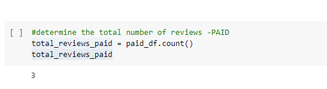

# Amazon_Vine_Analysis

## Overview of the analysis
The purpose of this analysis is to review the Amazon Vine Program and determine if there is a bias toward favorable reviews from Vine members.
The dataset used is from the Personal_Care_Appliances and was analyzed using PySpark to perform the ETL process to extract the dataset, transform the data, then connected to an AWS RDS instance.

## Results

## How many Vine reviews and non-Vine reviews were there?

o Vine reviews	

o Non-Vine reviews

## How many Vine reviews were 5 stars? How many non-Vine reviews were 5 stars?

o Vine 5 star reviews	

o Non-Vine 5 star reviews	

## What percentage of Vine reviews were 5 stars? What percentage of non-Vine reviews were 5 stars?

o Vine 5 star reviews percentage

o Non-Vine 5 star reviews percentage
